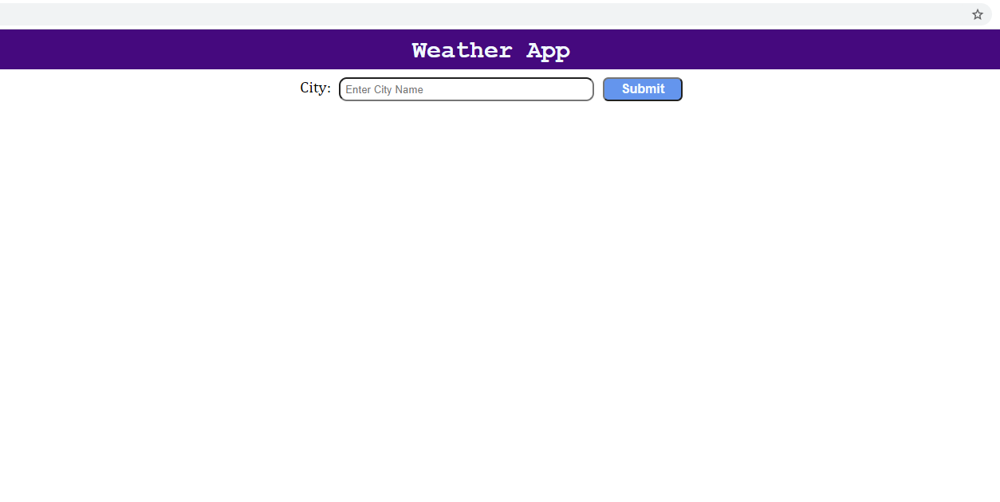

# Weather App

> Weather App fetches data from Open Weather Map API.

This projects implements using fetch method to return data from the weather api and return promises. The project also uses the try-catch block to handle scenarios where there is an error in the response from the API

## Built With

- HTML,
- CSS,
- JavaScript,
- Webpack

## Live Demo

[Live Demo Link](https://livedemo.com)

## Getting Started

To get a local copy up and running follow these simple example steps.

### Prerequisites

- Have latest version of JS installed.
- Have Node and NPM installed.
- Install the latest version of your browser of choice.

### Setup

- Fork the repo to your remote repository.
- Clone or download the repository to your local machine.

### Usage

- Run npm installto install the project pakages
- Run npm run devto bundle the packages for development. Dev is created for development, meaning that it supports hot module replacement, dev server, and a lot of things that assist your dev work
- Run npm run build when you want to deploy the project for production.
- Open the index.htmlfile in your browser.
- Type in a correct city or town name in the input field.
- If the input value is correct, the weather information about that city or town will be displayed.
- Feel free to change the temperature from fahrenheit to celcius and vice versa by clicking the Temperature toggle Button

## Authors

👤 **Rajkumar Das**

- Github: [@rajkumardas2701](https://github.com/rajkumardas2701)
- Twitter: [@Rajkuma58621299](https://twitter.com/Rajkuma58621299)
- Linkedin: [Rajkumar Das](https://www.linkedin.com/in/rajkumar-das-41308961/)

## 🤝 Contributing

Contributions, issues and feature requests are welcome!

Feel free to check the [issues page](https://github.com/rajkumardas2701/WeatherApp_JS/issues).

## Show your support

Give a ⭐️ if you like this project!

## 📝 License

This project is [MIT](lic.url) licensed.
